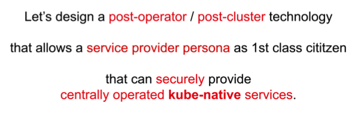
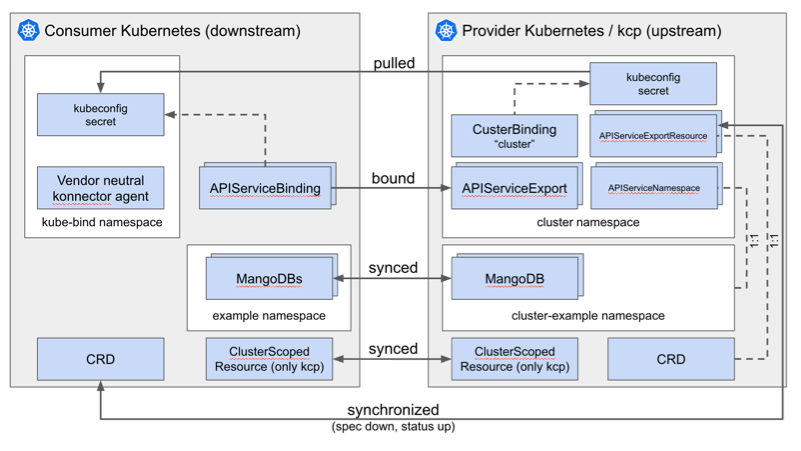

</img>

[](https://goreportcard.com/report/github.com/kbind-dev/kbind)
[](https://github.com/kbind-dev/kbind/blob/main/LICENSE)
[](https://github.com/kbind-dev/kbind/releases/latest)

# kbind

You are invited to [contribute](#contributing)!

## What is it?

kbind (formerly known as kube-bind) provides better support for service providers and consumers that reside in distinct Kubernetes clusters.

- A service provider defines its API in terms of CRDs and associated permission claims/limitations, and exports it for use from other clusters.
- Service consumers identify the services they want to consume.
- The service CRDs get installed in the service consumer clusters, with objects of the defined kinds written and read by the service consumers.
- The service provider indirectly reads and writes those objects as the interface to the service that it provides.
- The service provider does not inject controllers/operators into the service consumer's cluster.
- A single vendor-neutral, OpenSource agent per consumer cluster connects it with the requested services.

## Try it out

This is the 3 line pitch:

```shell
$ kubectl krew index add bind https://github.com/kube-bind/krew-index.git
$ kubectl krew install bind/bind
$ kubectl bind login https://mangodb
$ kubectl bind
Redirect to the browser to authenticate via OIDC.
BOOM – the MangoDB API is available in the local cluster,
       without anything MangoDB-specific running.
$ kubectl get mangodbs
```

## For more information

For more information go to https://kbind.dev or watch the [ContainerDays talk](https://www.youtube.com/watch?v=dg0g15Qv5Fo&t=1s)
or the [KubeCon talk](https://www.youtube.com/watch?v=Uv0ivz5xej4).

kbind is following this manifesto from the linked talk:



## Contributing

We ❤️ our contributors! If you're interested in helping us out, please check out
[Contributing to kbind](./CONTRIBUTING.md) and [kbind Project Governance](./GOVERNANCE.md).

## Getting in touch

There are several ways to communicate with us:

- The [`#kube-bind` channel](https://kubernetes.slack.com/archives/C046PRXNJ4W) in the [Kubernetes Slack workspace](https://slack.k8s.io)
- Our mailing list [kube-bind-dev](https://groups.google.com/g/kube-bind-dev) for development discussions.
- Our bi-weekly community meetings — every second Thursday at 11am EST (5pm CET).
    - By joining the [kube-bind-dev mailing list](https://groups.google.com/g/kube-bind-dev), you should receive an invite.
    - See our [community meeting notes document](https://docs.google.com/document/d/1qztpKOmdZu5iWq_4N9n3AZpcAPuPhBiGNbje5GPg0iM) for upcoming and past agendas.
    <!-- TODO(community-call-advertise): once the CNCF community page is registered, add: -->
    <!--   - The next community meeting dates are also available via our [CNCF community group](https://community.cncf.io/kube-bind/). -->
    <!-- TODO(community-call-advertise): once a YouTube channel is set up, add: -->
    <!--   - See recordings of past community meetings on [YouTube](TODO-youtube-url). -->

See the [community page](https://docs.kbind.dev/main/community) for more details.

## Technical Overview

</img>

All the actions shown between the clusters are done by the konnector, except: the pull at the start is done by the kubectl plugin that installs the konnector.

## Usage

To get familiar with setting up the environment, please check out docs at [kbind.dev](https://docs.kbind.dev/main/setup).

### Limitations

These limitations are part of the roadmap and will be addressed in the future.

* Currently we don't support related resources, like ConfigMaps, Secrets.
* We don't support lifecycle of `BoundSchema` resources, like schema changes.
* The backend currently does not support running with replicas > 1 due to missing external session storage implementation. Session storage is currently in-memory only, which prevents proper session sharing across multiple backend instances.
