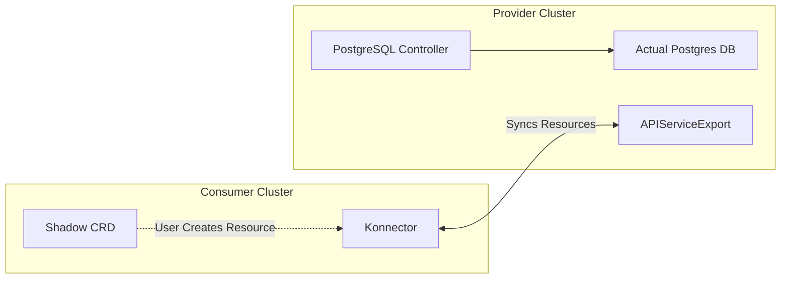
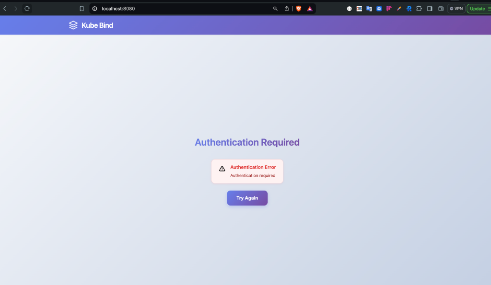
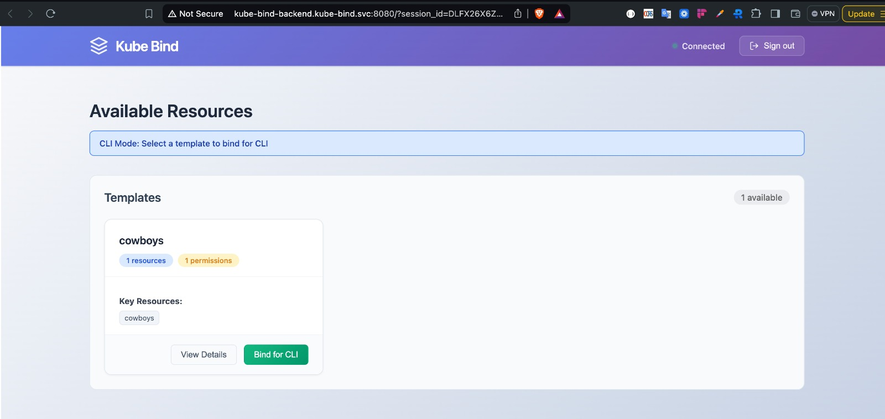

# Deep Dive: Understanding kube-bind Internals

> **Note:** Just want to get started quickly? Check out our [Quick Start Guide](2026-02-14-kube-bind-quickstart.md) which sets up everything automatically with `kubectl bind dev create`. This article explains the machinery under the hood—the "Hard Way".

If you’ve ever tried to make one cluster consume resources from another, you’ve probably had to deal with complicated networking setups, VPN tunnels, duplicated Custom Resource Definitions (CRDs), or custom-built controllers to keep everything in sync.

As organizations grow, the need for multi-cluster setups become inevitable, and this comes with its own headache especially when you need to share services or resource between clusters. Doing this in Kubernetes is inherently hard because clusters are isolated by design. They don’t natively “talk” to each other.

This is where kube-bind comes in.

<!-- more -->

To understand kube-bind, it helps to think about how mobile apps work.

When a developer builds an app, they don’t send the source code directly to every user. Instead, they publish it to an app marketplace like the App Store. Users can then browse, install, and use the app without needing direct access to the developer’s system.

kube-bind works in a similar way.

One Kubernetes cluster can “publish” selected APIs, and another cluster can “install” or bind to them. The consumer cluster doesn’t need full access to the provider cluster, it only interacts with the exported APIs, just like installing an app.

kube-bind provides a Kubernetes-native way to securely export APIs from one cluster and bind to them in another without stitching clusters together through complex networking configurations or manual synchronization.

In this article, we’ll explore what kube-bind is, why it exists, and how to use it step-by-step to share services across Kubernetes clusters.

## What Is kube-bind?

`kube-bind` is an open-source tool that allows you to export Kubernetes APIs from a **Service Provider** cluster and consume them in a **Consumer** cluster.

It effectively "projects" an API (like a CRD) from one cluster to another. To the consumer, it feels like the resource is local. They can create a `PostgreSQL` object in their namespace and interact with it just like any other Kubernetes resource, however, the actual logic and heavy operational workload happens on the provider's side.



> `kube-bind` focuses on **service binding**. It does not merge or federate control planes. Instead, it allows one cluster to securely consume specific APIs exported by another.

## Core Concepts & API Objects

Under the hood, `kube-bind` uses a set of Custom Resource Definitions (CRDs) to manage the lifecycle of exported services and bindings. Here are the key objects you'll encounter:

- **`APIServiceExport`**: Represents a specific API (CRD) that the provider wants to export. An export makes the API available to bind.
- **`APIServiceExportTemplate`**: A template used to instantiate the `APIServiceExport`. It defines what resources can be exported and carries configuration for the export.
- **`ClusterBinding`**: A resource on the consumer side that represents the connection to a specific provider. It holds the authentication details and endpoint information.
- **`APIServiceBinding`**: A resource on the consumer side that represents a binding to a specific exported API. When created, it triggers the synchronization process.
- **`Konnector`**: The lightweight agent running in the consumer cluster. It watches `APIServiceBinding` resources and handles the actual synchronization of data between the consumer and provider.

## The "Hard Way": Manual Setup & Architecture

To really understand how `kube-bind` works, we're going to set it up manually. This is what the `dev create` command does automatically, but looking at the individual steps reveals the architecture.

Let's see this in action. We'll simulate both the provider and consumer on your local machine.

### Prerequisites

You'll need:

- [kind](https://kind.sigs.k8s.io/)
- [kubectl](https://kubernetes.io/docs/tasks/tools/)
- [kube-bind CLI](https://github.com/kube-bind/kube-bind/releases)

### Install kube-bind

The easiest way to install the `kube-bind` CLI is via [krew](https://krew.sigs.k8s.io/), the plugin manager for `kubectl`. Since `kube-bind` is in its own index, you need to add it first:

```bash
kubectl krew index add bind https://github.com/kube-bind/krew-index.git
kubectl krew install bind/bind
```

You should see output similar to this:

```text
➜  kubectl krew index add bind https://github.com/kube-bind/krew-index.git
WARNING: You have added a new index from "https://github.com/kube-bind/krew-index.git"
The plugins in this index are not audited for security by the Krew maintainers.
Install them at your own risk.

➜  kubectl krew install bind/bind
Updated the local copy of plugin index "bind".
Installing plugin: bind
Installed plugin: bind
\
 | Use this plugin:
 |      kubectl bind
 | Documentation:
 |      https://kube-bind.io/
/
```

If you don't have krew installed, you can download the binary directly from the [releases page](https://github.com/kube-bind/kube-bind/releases).

### Step 1: Create the Clusters

We need at least two clusters, but first, we'll start by creating a **provider** cluster.

**Create the provider cluster with port mapping:**

```bash
cat <<EOF | kind create cluster --name provider --config=-
kind: Cluster
apiVersion: kind.x-k8s.io/v1alpha4
nodes:
- role: control-plane
  extraPortMappings:
  - containerPort: 6443
    hostPort: 6443
EOF
```

**Create the consumer cluster:**

```bash
kind create cluster --name consumer
```

You can verify that your clusters are ready by checking the nodes:

```bash
➜  kubectl get nodes --context kind-provider

NAME                     STATUS   ROLES           AGE     VERSION
provider-control-plane   Ready    control-plane   3m58s   v1.27.3

➜  kubectl get nodes --context kind-consumer

NAME                     STATUS   ROLES           AGE     VERSION
consumer-control-plane   Ready    control-plane   3m16s   v1.27.3
```

### Step 2: Set Up the Provider

Switch to the provider context. We need to install the **kube-bind backend**.

To ensure authentication works correctly and enable cross-cluster connectivity, we need to configure hostname resolution:

**Linux/macOS**:

```bash
sudo sh -c "echo '127.0.0.1 kube-bind-backend.kube-bind.svc provider-control-plane' >> /etc/hosts"
```

**Windows**:
Add `127.0.0.1 kube-bind-backend.kube-bind.svc` to `C:\Windows\System32\drivers\etc\hosts`.

Now, install the backend using Helm, configuring it to use this domain:

```bash
kubectl config use-context kind-provider

# Install the backend using Helm
helm upgrade --install \
    --namespace kube-bind \
    --create-namespace \
    --set image.tag=v0.7.1 \
    --set backend.externalAddress=https://provider-control-plane:6443 \
    --set backend.tlsExternalServerName=kubernetes.default.svc \
    --set backend.oidc.issuerUrl=http://kube-bind-backend.kube-bind.svc:8080/oidc \
    --set backend.oidc.callbackUrl=http://kube-bind-backend.kube-bind.svc:8080/api/callback \
    kube-bind oci://ghcr.io/kube-bind/charts/backend --version 0.7.1
```

> **Note:** The OIDC configuration used here (which uses the built-in mock OIDC provider of `kube-bind-backend`) is for demonstration purposes only. For a production deployment, you must integrate with a real OIDC provider. See [Installation with Helm](../../setup/helm.md) for production guidelines.

> **Important Configuration Details:**
>
> - `backend.externalAddress=https://provider-control-plane:6443` - This is the address the Konnector will use to connect to the provider's API server.
> - `backend.tlsExternalServerName=kubernetes.default.svc` - This ensures TLS verification succeeds even though we're connecting via a custom hostname.
> - `backend.oidc.callbackUrl` - Must include the `http://` scheme to ensure proper browser redirects during authentication.

After installing, verify that the backend is running:

```bash
kubectl get po -n kube-bind
```

You should see something like this:

```text
NAME                                 READY   STATUS    RESTARTS   AGE
kube-bind-backend-6779b5b99f-vczmq   1/1     Running   0          18m
```

Since we are running locally in Kind without an Ingress, we need to port-forward the backend service.

**Open a new terminal window** and run:

```bash
kubectl port-forward svc/kube-bind-backend -n kube-bind 8080:8080 --context kind-provider
```


_If you visit `http://kube-bind-backend.kube-bind.svc:8080` in your browser, you'll see this screen. This is normal and confirms the backend is running!_

### Step 3: Exporting an API Service

Now that the backend is running, we can export an API. We'll use the **Cowboy** CRD included in the `kube-bind` repository as our example.

First, apply the CRD to the **provider** cluster:

```bash
kubectl apply -f https://raw.githubusercontent.com/kube-bind/kube-bind/main/deploy/examples/crd-cowboys.yaml
```

Verify that the CRD is installed:

```bash
kubectl get crd
```

You should see `cowboys.wildwest.dev` in the list:

```text
NAME                                     CREATED AT
apiserviceexports.kube-bind.io           2026-02-14T13:04:56Z
...
cowboys.wildwest.dev                     2026-02-14T13:57:13Z
```

Now, we need to **export** this service so consumers can find it. We do this by creating an `APIServiceExportTemplate`. This tells the backend to list "Cowboys" in its service catalog.

```bash
kubectl apply -f https://raw.githubusercontent.com/kube-bind/kube-bind/main/deploy/examples/template-cowboys.yaml
```

Verify that the template is created:

```bash
kubectl get apiserviceexporttemplates
```

Output:

```text
NAME      RESOURCES      PERMISSIONCLAIMS   AGE
cowboys   wildwest.dev   secrets            12s
```

The service is now exported!

### Step 4: Bind the Consumer

Switch to the **consumer** cluster.

```bash
kubectl config use-context kind-consumer
```

Run the login command to authenticate with the provider:

```bash
kubectl bind login http://kube-bind-backend.kube-bind.svc:8080
```

You should see output similar to:

```text
Connecting to kube-bind server http://kube-bind-backend.kube-bind.svc:8080...
Started local callback server at http://127.0.0.1:64184/callback
Opening browser for authentication...
🔑 Successfully authenticated to kube-bind-backend.kube-bind.svc:8080
Configuration saved to: /Users/username/.kube-bind/config
```

Now run the bind command:

```bash
kubectl bind http://kube-bind-backend.kube-bind.svc:8080
```

This will open your browser showing the available services in the Provider's template catalog. Amongst them, you'll see the **Cowboys** template that we exported earlier.



Click **"Bind for CLI"** to proceed. After clicking, your browser will show a success message:


Meanwhile, back in your terminal, you'll see the CLI deploying the Konnector:

```text
🌐 Opening kube-bind UI in your browser...
Browser opened successfully
Waiting for binding completion from UI...
   (Press Ctrl+C to cancel)

Binding completed successfully!
Created kube-bind namespace.
🔒 Created secret kube-bind/kubeconfig-9lbzx for host https://provider-control-plane:6443, namespace kube-bind-enkvby5uzkct
🚀 Deploying konnector v0.7.1 to namespace kube-bind.
   Waiting for the konnector to be ready.................
✅ Created APIServiceBinding cowboys for 1 resources
Created 1 APIServiceBinding(s):
  - cowboys
Resources bound successfully!
```

Behind the scenes, the CLI created a `kube-bind` namespace, an `APIServiceBinding`, deploys the `konnector` and creates some other resource in the consumer cluster. The `APIServiceBinding` resource tells the Konnector which services to sync from the provider.

Check available namespaces

```bash
kubectl get ns
```

You should see the `kube-bind` namespace:

```text
NAME                 STATUS   AGE
default              Active   6h6m
kube-bind            Active   92s
kube-node-lease      Active   6h6m
kube-public          Active   6h6m
kube-system          Active   6h6m
local-path-storage   Active   6h6m
```

Check the Konnector pods:

```bash
kubectl get po -n kube-bind
```

Output:
We can see the konnector pods running in the `kube-bind` namespace.

```text
NAME                         READY   STATUS    RESTARTS   AGE
konnector-547ff86976-5rmh8   1/1     Running   0          98s
konnector-547ff86976-xkcdm   1/1     Running   0          98s
```

### Step 5: Verify and Use

After the binding completes, several CRDs will be installed in your consumer cluster. Let's verify:

```bash
kubectl get crd
```

You should see the kube-bind infrastructure CRDs along with the Cowboys CRD:

```text
NAME                                    CREATED AT
apiservicebindingbundles.kube-bind.io   2026-02-14T23:37:29Z
apiservicebindings.kube-bind.io         2026-02-14T23:37:29Z
cowboys.wildwest.dev                    2026-02-14T23:37:37Z
```

The `cowboys.wildwest.dev` CRD is now available locally! The other CRDs are part of the kube-bind infrastructure that manages the binding lifecycle.

Check that the **Cowboy** CRD is available:

```bash
kubectl get crd cowboys.wildwest.dev
```

Now, you can create a `Cowboy` resource directly in your consumer cluster. The magic is that this resource will be managed by the provider!

```bash
kubectl apply -f - <<EOF
apiVersion: wildwest.dev/v1alpha1
kind: Cowboy
metadata:
  name: billy-the-kid
  namespace: default
spec:
  intent: "Ride the range and protect the cattle"
EOF
```

Verify it exists:

```bash
kubectl get cowboys
```

Output:

```text
NAME            AGE
billy-the-kid   6s
```

The resource is created locally, but managed remotely!

## Real-World Use Cases

- **SaaS Platforms**: Software vendors can deliver their application into customer clusters without requiring complex installs. Customers get a native CRD, vendors manage the complexity remotely.
- **Centralized Platform Teams**: Offer "Database-as-a-Service" or "AI-Model-as-a-Service" to internal dev teams from a central management cluster. The dev teams just see a `Postgres` or `Model` resource in their namespace.
- **Hybrid Cloud**: Keep sensitive data (like a database) in a secure on-prem cluster while allowing cloud-based clusters to interact with it via Kubernetes APIs. `kube-bind` handles the secure connection.

### See It In Action

Check out our integration guides to see how `kube-bind` works with popular projects:

- [**Crossplane**](../../usage/integrations/crossplane.md): Manage cloud resources like AWS S3 or GCP CloudSQL as a service.
- [**Kro**](../../usage/integrations/kro.md): The easiest way to create and export custom APIs.
- [**CloudNativePG**](../../usage/integrations/cloudnativepg.md): Database-as-a-Service on Kubernetes.
- [**cert-manager**](../../usage/integrations/cert-manager.md): Certificate management as a service.

## Recap

`kube-bind` solves the multi-cluster service sharing problem by projecting APIs rather than moving infrastructure. It keeps the consumer cluster lightweight while giving platform teams full control over the service lifecycle.
