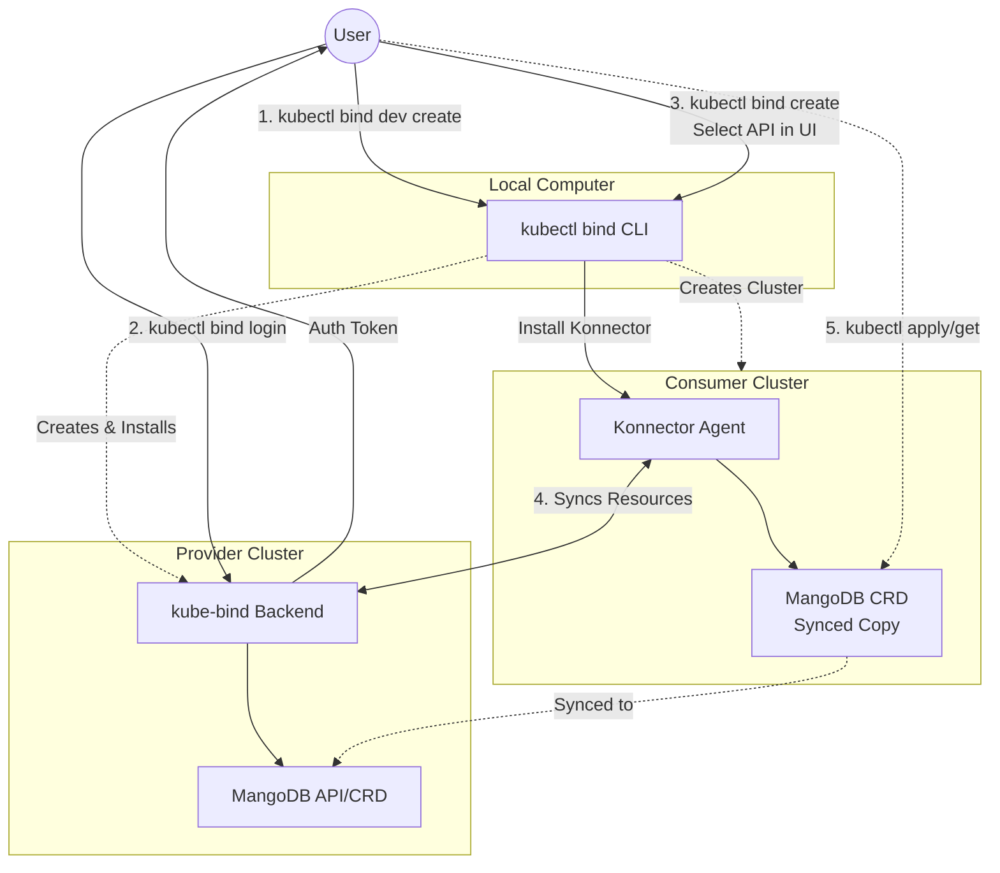
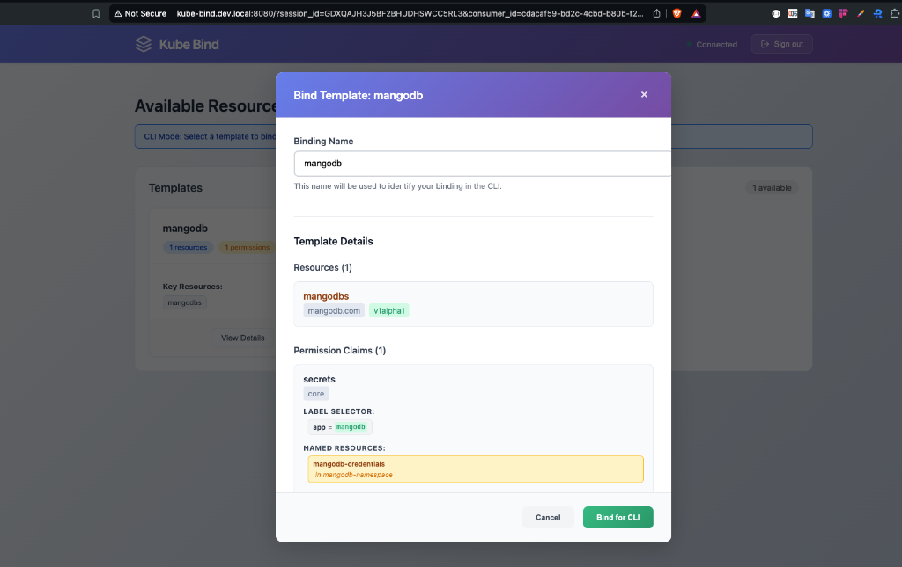

# Getting Started with kube-bind: The Quick Way

`kube-bind` facilitates service sharing between Kubernetes clusters. It allows a **Service Provider** cluster to export APIs and a **Consumer** cluster to bind to them, projecting the resources into the consumer's cluster. This enables seamless cross-cluster consumption without complex networking or federation.

Here is what we will build:



<!-- more -->

In this guide, we'll get you up and running with `kube-bind` in minutes. We'll use the `dev create` command to automatically provision a local playground with a Provider and Consumer cluster.

> **Note:** If you want to understand how `kube-bind` works internally or set it up manually for production, check out our deep dive: [Understanding kube-bind Internals](2026-02-14-kube-bind-internals.md).

## Prerequisites

You'll need:

- [Docker](https://www.docker.com/) running.
- [kubectl](https://kubernetes.io/docs/tasks/tools/).
- `kube-bind` CLI installed.

### Install kube-bind

The easiest way is via [krew](https://krew.sigs.k8s.io/):

```bash
kubectl krew index add bind https://github.com/kube-bind/krew-index.git
kubectl krew install bind/bind
```

## Step 1: Create the Environment

Run the following command to spin up the entire demo environment:

```bash
kubectl bind dev create
```

> **Note:** The `dev create` command sets up a mock OIDC provider for testing purposes. This is **not** suitable for production. For a production-ready deployment with real OIDC integration, please refer to our [Installation with Helm](../../setup/helm.md) guide.

This will:

1.  Create a **Provider** cluster (`kind-provider`).
2.  Create a **Consumer** cluster (`kind-consumer`).
3.  Install the `kube-bind-backend` on the provider.
4.  Configure networking and OIDC mock services.

Once it finishes, you'll see output like this:

```text
kube-bind Development Environment Setup

EXPERIMENTAL: kube-bind dev command is in preview
Requirements: Docker must be installed and running

Warning: Could not automatically add host entry. Please run:
  echo '127.0.0.1 kube-bind.dev.local' | sudo tee -a /etc/hosts

Creating kind cluster kind-provider with network kube-bind-dev
Kind cluster kind-provider created
Helm chart installed successfully

Creating kind cluster kind-consumer with network kube-bind-dev
Kind cluster kind-consumer created
kube-bind dev environment is ready!

Configuration:
• Provider cluster kubeconfig: kind-provider.kubeconfig
• Consumer cluster kubeconfig: kind-consumer.kubeconfig
• kube-bind server URL: http://kube-bind.dev.local:8080

Next Steps:

1. Add to /etc/hosts (if not already done):
echo '127.0.0.1 kube-bind.dev.local' | sudo tee -a /etc/hosts

2. Login to authenticate to the provider cluster:
kubectl bind login http://kube-bind.dev.local:8080

3. Bind an API service from provider to consumer:
PROVIDER_IP=$(docker inspect kind-provider-control-plane | jq -r '.[0].NetworkSettings.Networks["kube-bind-dev"].IPAddress') && KUBECONFIG=kind-consumer.kubeconfig kubectl bind --konnector-host-alias ${PROVIDER_IP}:kube-bind.dev.local
```

## Step 2: Authenticate

Copy and run the login command provided in the output:

```bash
kubectl bind login http://kube-bind.dev.local:8080
```

Output:

```text
Connecting to kube-bind server http://kube-bind.dev.local:8080...
Started local callback server at http://127.0.0.1:56642/callback
Opening browser for authentication...
🔑 Successfully authenticated to kube-bind.dev.local:8080
Configuration saved to: /Users/olalekanodukoya/.kube-bind/config
```

This will open your browser to authenticate. Since this is a dev environment, just follow the prompts.

## Step 3: Bind a Service

Now, switch to the consumer role and bind to a service. Copy the second command from the `dev create` output. It will look something like this:

```bash
PROVIDER_IP=$(docker inspect kind-provider-control-plane | jq -r '.[0].NetworkSettings.Networks["kube-bind-dev"].IPAddress') && KUBECONFIG=kind-consumer.kubeconfig kubectl bind --konnector-host-alias ${PROVIDER_IP}:kube-bind.dev.local
```

This will open a web interface where you can choose which API to bind. Select **mangodb** and click **Bind for CLI**.



Output:

```text
🌐 Opening kube-bind UI in your browser...
Browser opened successfully
Waiting for binding completion from UI...
   (Press Ctrl+C to cancel)

Binding completed successfully!
Created kube-bind namespace.
🔒 Created secret kube-bind/kubeconfig-tjm2k for host https://kube-bind.dev.local:6443, namespace kube-bind-3iwzhtescg5o0
🚀 Deploying konnector v0.7.0 to namespace kube-bind.
   Waiting for the konnector to be ready.................
✅ Created APIServiceBinding mangodb for 1 resources
Created 1 APIServiceBinding(s):
  - mangodb
Resources bound successfully!
```

You can verify the new CRDs are available:

```bash
kubectl get crd
```

Output:

```text
NAME                                    CREATED AT
apiservicebindingbundles.kube-bind.io   2026-02-17T18:50:02Z
apiservicebindings.kube-bind.io         2026-02-17T18:50:02Z
mangodbs.mangodb.com                    2026-02-17T18:50:13Z
```

## Step 4: Use the Service

Once the binding is complete, you can interact with the `MangoDB` resource directly from your consumer cluster!

```bash
export KUBECONFIG=kind-consumer.kubeconfig

# Create a MangoDB resource
kubectl apply -f - <<EOF
apiVersion: mangodb.com/v1alpha1
kind: MangoDB
metadata:
  name: my-first-mangodb-instance
  namespace: default
spec:
  tier: Dedicated
EOF

# Verify it exists
kubectl get mangodb
```

You have successfully bound a remote API to your local cluster!

## What's Next?

`kube-bind` is powerful when combined with other tools. Check out our integration guides to see how you can use it with:

- [**Crossplane**](../../usage/integrations/crossplane.md): Offer cloud resources (AWS S3, GCP CloudSQL) as a service.
- [**Kro**](../../usage/integrations/kro.md): Define and export custom APIs without writing controllers.
- [**CloudNativePG**](../../usage/integrations/cloudnativepg.md): Database-as-a-Service on Kubernetes.
- [**cert-manager**](../../usage/integrations/cert-manager.md): Certificate management as a service.

## Cleanup

To clean up the environment:

```bash
kubectl bind dev delete
```
