# Securing kube-bind with Keycloak: A Production-Ready OIDC Setup

In this tutorial, I'll be showing you how to integrate Keycloak into `kube-bind` so that authentication is handled by an external identity provider instead of the embedded mock one.

If you've been following along from the [previous posts](2026-02-14-kube-bind-internals.md), you know that `kube-bind` lets you project APIs from a provider cluster into a consumer cluster. To do that securely, it uses OIDC for authentication. In the quickstart guide, we used the embedded OIDC provider — which is great for tinkering locally, but absolutely not something you'd ship to production.

In production, you want a proper identity provider. One that manages users, groups, tokens, and sessions correctly. For this, we'll be making use of Keycloak.

<!-- more -->

[Keycloak](https://www.keycloak.org/) is one of the most widely deployed open-source identity solutions out there. It supports OpenID Connect (OIDC), has a nice admin UI, and is battle-tested. Since `kube-bind` speaks OIDC, Keycloak is a very natural fit.

Here is what we'll build:

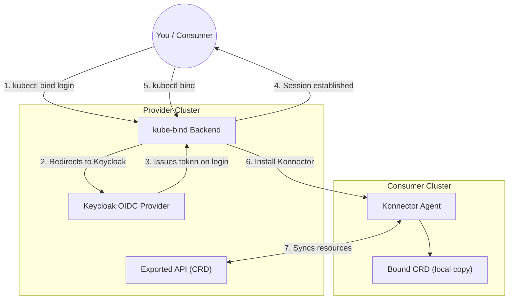

The key difference from the dev setup is steps 2 and 3 — instead of clicking through a mock login screen, users are redirected to Keycloak's real login page. `kube-bind` validates the resulting tokens against Keycloak's OIDC discovery endpoint.

## Prerequisites

You'll need:

- [kind](https://kind.sigs.k8s.io/)
- [kubectl](https://kubernetes.io/docs/tasks/tools/)
- [Helm](https://helm.sh/) 3.x
- The `kube-bind` CLI — see [Quick Start](2026-02-14-kube-bind-quickstart.md) for installation

> **Note:** We'll use port-forwarding here to keep things simple. A production setup would use a proper Ingress or Gateway with TLS. See [Installation with Helm](../../setup/helm.md) for that.

---

## Step 1: Create the Provider Cluster

We need a Kind cluster with port mappings so we can reach both Keycloak and the kube-bind backend from our machine:

```bash
cat <<EOF | kind create cluster --name provider --config=-
kind: Cluster
apiVersion: kind.x-k8s.io/v1alpha4
nodes:
- role: control-plane
  kubeadmConfigPatches:
  - |
    kind: ClusterConfiguration
    apiServer:
        certSANs:
        - "provider-control-plane"
        - "127.0.0.1"
  extraPortMappings:
  - containerPort: 8080
    hostPort: 8080
  - containerPort: 8443
    hostPort: 8443
  - containerPort: 6443
    hostPort: 6443
EOF
```

> **Why the certSANs?** Since we are exposing the API server on port `6443` and using custom hostnames like `provider-control-plane`, we need to tell Kind to include these in its TLS certificates. Without this, both **kubectl** and the **kube-bind CLI** would reject the connection with a certificate validation error.

Then add some hostname aliases so we can refer to our services by name:

```bash
sudo sh -c "echo '127.0.0.1 kube-bind.local keycloak.local provider-control-plane' >> /etc/hosts"
```

> [!TIP]
> **Fixing "Certificate is valid for..." Errors:** If you see an error like `x509: certificate is valid for ..., not 0.0.0.0`, it's because `kubectl` is trying to connect via an IP that is not in the certificate. You can fix your current context instantly by running:
>
> ```bash
> kubectl config set-cluster kind-provider --server=https://127.0.0.1:6443
> ```

---

## Step 2: Deploy Keycloak

We'll use the **KeycloakX** Helm chart from [codecentric](https://github.com/codecentric/helm-charts). This is a great community-maintained chart that uses the official Keycloak images.

Because we need to set some environment variables for the admin user, we'll create a small `values-keycloak.yaml` file. This is much cleaner than trying to pass complex strings via the CLI.

```bash
cat <<EOF > values-keycloak.yaml
fullnameOverride: keycloak
command:
  - "/opt/keycloak/bin/kc.sh"
  - "start-dev"
extraEnv: |
  - name: KEYCLOAK_ADMIN
    value: admin
  - name: KEYCLOAK_ADMIN_PASSWORD
    value: admin123
  - name: KC_HTTP_RELATIVE_PATH
    value: /auth
EOF

helm repo add codecentric https://codecentric.github.io/helm-charts
helm repo update

helm upgrade --install keycloak codecentric/keycloakx \
  --namespace keycloak \
  --create-namespace \
  -f values-keycloak.yaml
```

You should see the following output:

```text
Release "keycloak" does not exist. Installing it now.
NAME: keycloak
LAST DEPLOYED: Sun Feb 22 21:52:49 2026
NAMESPACE: keycloak
STATUS: deployed
REVISION: 1
TEST SUITE: None
NOTES:
***********************************************************************
*                                                                     *
*                Keycloak.X Helm Chart by codecentric AG              *
*                                                                     *
***********************************************************************

Keycloak was installed with a Service of type ClusterIP

Create a port-forwarding with the following commands:

export POD_NAME=$(kubectl get pods --namespace keycloak -l "app.kubernetes.io/name=keycloakx,app.kubernetes.io/instance=keycloak" -o name)
echo "Visit http://127.0.0.1:8080 to use your application"
kubectl --namespace keycloak port-forward "$POD_NAME" 8080
```

Wait for it to come up (Heads up: this chart deploys a **StatefulSet**, not a Deployment):

```bash
kubectl rollout status statefulset/keycloak -n keycloak --timeout=120s
```

Patch the service to expose port 8443 for OIDC compatibility since we're
technically running the cluster in our local machine.

```bash
kubectl patch service keycloak-http -n keycloak --type='json' -p='[
  {"op": "replace", "path": "/spec/ports/2/port", "value": 8444},
  {"op": "add", "path": "/spec/ports/-", "value": {"name": "oidc-compat", "port": 8443, "targetPort": "http", "protocol": "TCP"}}
]'
```

Port-forward so we can access the admin console:

```bash
kubectl port-forward svc/keycloak-http -n keycloak 8443:80 &
```

Head over to [http://keycloak.local:8443](http://keycloak.local:8443). You'll be redirected to the Keycloak login page:

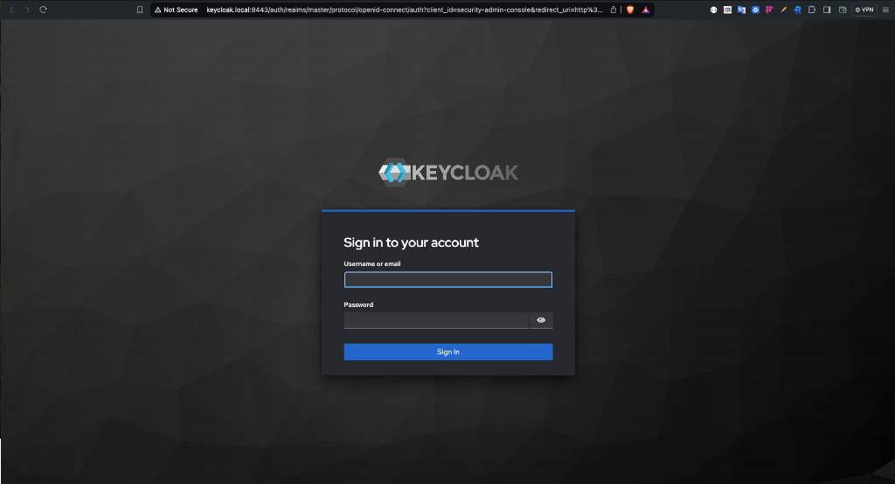

Log in with `admin` / `admin123`. You should see the Keycloak admin console.

---

## Step 3: Configure Keycloak

This is the most important step. We need to set up a few things in Keycloak:

1. A **Realm** — a logical namespace for our identity space
2. A **Client** — representing the `kube-bind` backend
3. A **Group** — to control which users can bind services
4. A **User** — so we have someone to log in as

### Create a Realm

In the top-left corner of the admin console, you'll see a **Manage realms** option; click it. You'll see a list of realms, one of which is named `master`. We won't be using that one. Click on the **Create realm** button.

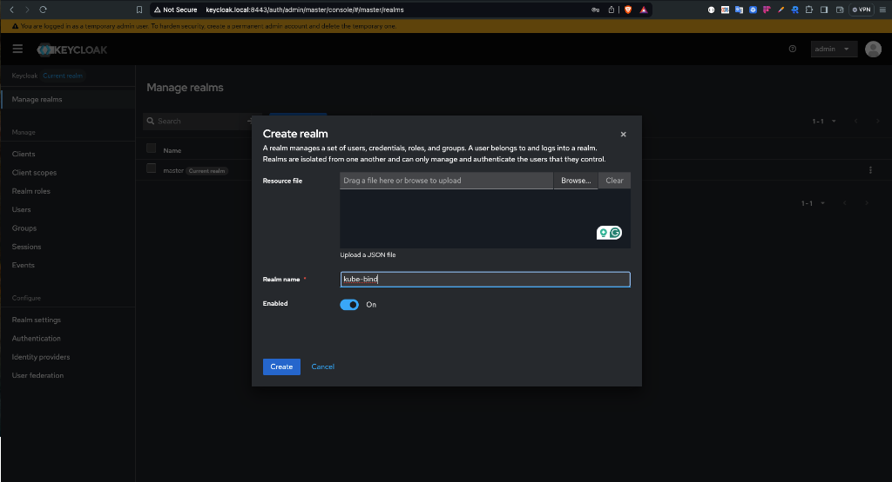

Name the new realm `kube-bind` and click **Create**.

### Create a Client

This is the entry for the `kube-bind` backend application in Keycloak.

Go to **Clients** → **Create client** and fill in the following:

- **Client ID**: `kube-bind`
- **Client type**: `OpenID Connect`

Click **Next**. On the capability config screen:

- Enable **Client authentication** (this generates a client secret)
- Keep **Standard flow** checked

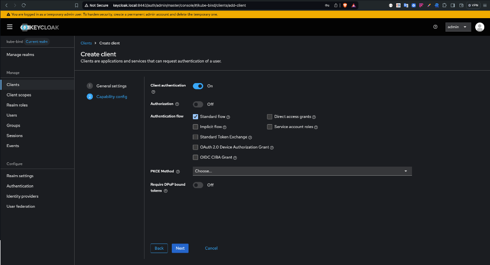

Click **Next**. On the login settings screen:

- **Valid redirect URIs**: `http://kube-bind.local:8080/api/callback`
- **Web origins**: `http://kube-bind.local:8080`

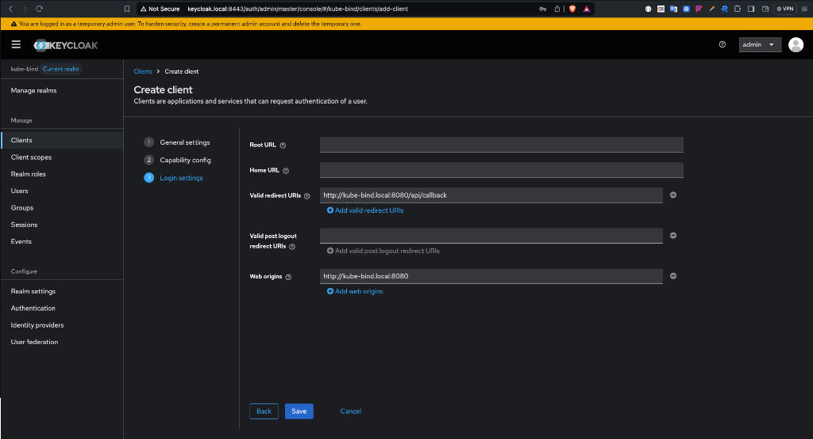

Click **Save**.

### Retrieve the Client Secret

Now that the client is created, we need its secret to give to the `kube-bind` backend.

1. Go to the **Credentials** tab at the top.
2. Under **Client Secret**, click the copy icon to copy the value to your clipboard.

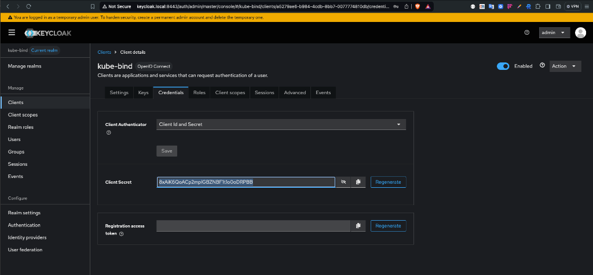

> **Note:** If you don't see the **Credentials** tab, make sure **Client authentication** is toggled to **ON** in the client's **Settings** tab.

### Create a Group

`kube-bind` lets you restrict who can create bindings based on OIDC group membership. Let's set that up.

Go to **Groups** → **Create group**, name it `kube-bind-users`, and click **Create**.

### Create a Test User

Go to **Users** → **Create new user** and fill in a **Username** (e.g., `platform-operator`). Toggle **Email verified** to on, then click **Create**.

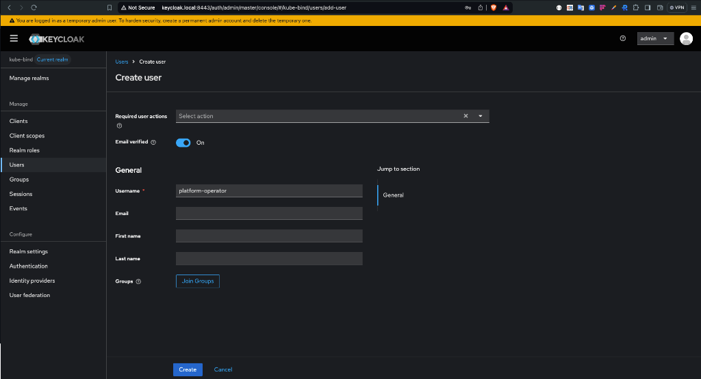

Go to the **Credentials** tab → **Set password** (something like `password123`, and disable temporary). Then go to the **Groups** tab → **Join group** → select `kube-bind-users`.

> **Technical Note on Groups:** The `kube-bind` backend is hardcoded to look for a claim named `groups` in your OIDC token. This is why the **Token Claim Name** in the Keycloak mapper MUST be exactly `groups`. If you use a different name, the backend won't "see" your group membership even if you are in the right group!

### Configure Client Scopes

Keycloak won't grant scopes like `profile` or `groups` unless they are explicitly assigned to the client.

#### 1. Create the 'groups' Scope

Instead of adding a mapper directly to the client, we'll create a reusable scope:

1. In the sidebar, click **Client scopes** → **Create client scope**.
2. **Name**: `groups`
3. Click **Save**.
4. Go to the **Mappers** tab → **Configure a new mapper** → **Group Membership**.
5. **Name**: `groups`, **Token Claim Name**: `groups`.
6. Ensure **Full group path** is `OFF`.
7. Click **Save**.

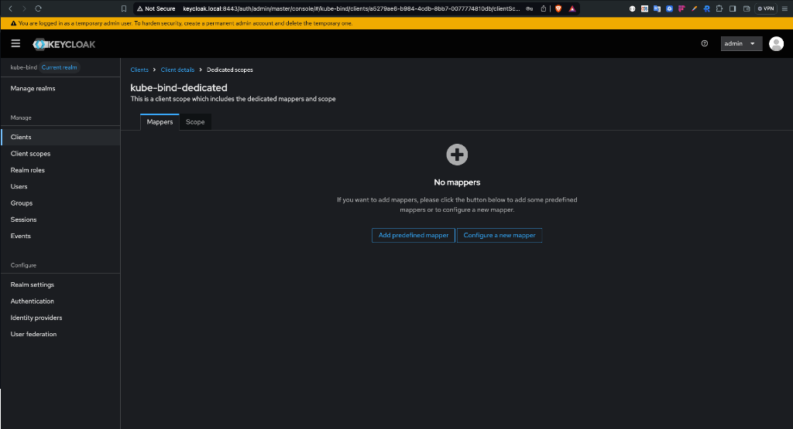

#### 2. Assign Scopes to the Client

Now, we must tell the `kube-bind` client to actually use these scopes. Some of these are built-in to Keycloak, while `groups` is the one we just created:

1. Go to **Clients** → `kube-bind` → **Client scopes** tab.
2. Click **Add client scope**.
3. Select `profile`, `email`, and `offline_access` (these are built-in and already exist).
4. Also select the `groups` scope you just created.

> **Check the pagination!** Keycloak's "Add client scope" dialog is paginated. If you don't see `profile` or `email` on the first page, click the arrow at the bottom right to go to the next page.

5. Click **Add** and choose **Default**.

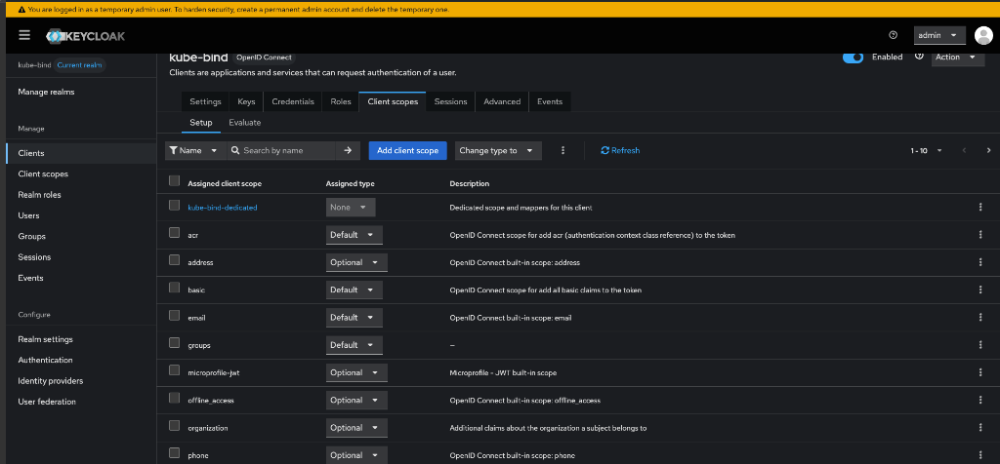

That's Keycloak done! The `kube-bind` backend will now be able to request and receive these scopes.

---

## Step 4: Deploy kube-bind

Keycloak's OIDC issuer URL follows this pattern: `http://<host>/auth/realms/<realm>`. For us, that's `http://keycloak.local:8443/auth/realms/kube-bind`.

```bash hl_lines="4 15"
kubectl config use-context kind-provider

helm upgrade --install kube-bind \
    --namespace kube-bind \
    --create-namespace \
    --set image.tag=v0.7.1 \
    --set backend.externalAddress=https://provider-control-plane:6443 \
    --set backend.tlsExternalServerName=kubernetes.default.svc \
    --set backend.oidc.type=external \
    --set backend.oidc.issuerUrl=http://keycloak.local:8443/auth/realms/kube-bind \
    --set backend.oidc.clientId=kube-bind \
    --set backend.oidc.clientSecret=cSmfhB3RNuetE8pgz1hDVjDHsDpc2r2v\
    --set backend.oidc.callbackUrl=http://kube-bind.local:8080/api/callback \
    --set backend.oidc.allowedGroups={kube-bind-users} \
    oci://ghcr.io/kube-bind/charts/backend --version 0.7.1
```

Replace `<YOUR-CLIENT-SECRET>` with what you copied from the Keycloak credentials tab.

> **Heads up:** Never paste secrets directly into shell history in production. Use a Kubernetes Secret or an environment variable via `--set backend.oidc.clientSecret=$OIDC_CLIENT_SECRET`.

### Networking Adjustment (Kind Specific)

Since we are running in Kind, the `kube-bind` pod doesn't know about the `keycloak.local` entry on your host's `/etc/hosts` file. Without this next step, the backend will try to reach itself on `127.0.0.1:8443` and fail.

We need to tell the pod that `keycloak.local` is actually the IP of our Keycloak Service.

```bash
# 1. Get the ClusterIP of the Keycloak service
KEYCLOAK_IP=$(kubectl get svc keycloak-http -n keycloak -o jsonpath='{.spec.clusterIP}')

# 2. Patch the backend to add a hostAlias
kubectl patch deployment kube-bind-backend -n kube-bind --type='json' -p="[
  {\"op\": \"add\", \"path\": \"/spec/template/spec/hostAliases\", \"value\": [
    {\"ip\": \"$KEYCLOAK_IP\", \"hostnames\": [\"keycloak.local\"]}
  ]}
]"
```

Verify everything is running:

```bash
kubectl get po -n kube-bind
```

```text
NAME                                 READY   STATUS    RESTARTS   AGE
kube-bind-backend-67b5bc9768-l9vr4  1/1     Running   0          45s
```

Port-forward the backend:

```bash
kubectl port-forward svc/kube-bind-backend -n kube-bind 8080:8080 &
```

---

## Step 5: Export an API

Now let's give the consumer something to bind to. We'll use the **Cowboys** example CRD that ships with `kube-bind`:

```bash
kubectl apply -f https://raw.githubusercontent.com/kube-bind/kube-bind/main/deploy/examples/crd-cowboys.yaml
kubectl apply -f https://raw.githubusercontent.com/kube-bind/kube-bind/main/deploy/examples/template-cowboys.yaml
```

Verify it's exported:

```bash
kubectl get apiserviceexporttemplates
```

```text
NAME      RESOURCES      PERMISSIONCLAIMS   AGE
cowboys   wildwest.dev   secrets            8s
```

---

## Step 6: Bind from the Consumer

Create the consumer cluster:

```bash
kind create cluster --name consumer
kubectl config use-context kind-consumer
```

Run the login command:

```bash
kubectl bind login http://kube-bind.local:8080
```

Your browser will open — and instead of the mock login page, you'll see **Keycloak's real login form**. Log in with `platform-operator` and the password you set earlier.

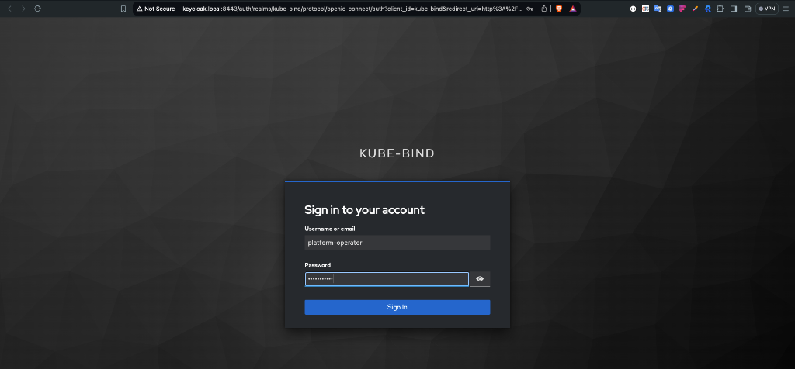

> On your first login, Keycloak might ask you to **Update Account Information** (First name, Last name, and Email). This is a standard "Required Action" for new users. Just fill in the details and click **Submit**.
>
> 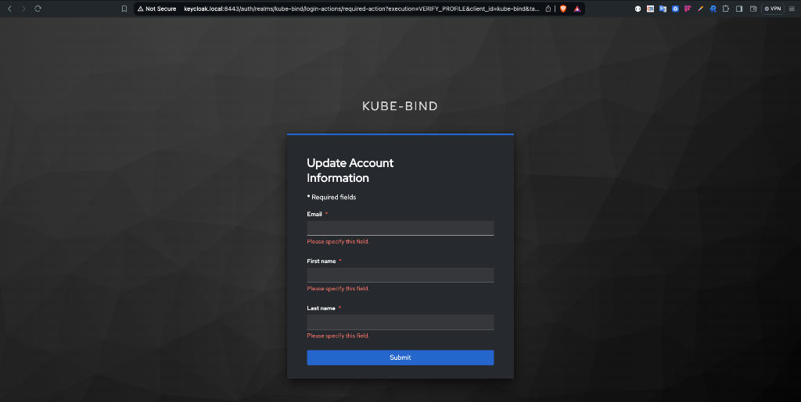
>
> Once you submit your information, you'll see the classic `kube-bind` success page:
>
> 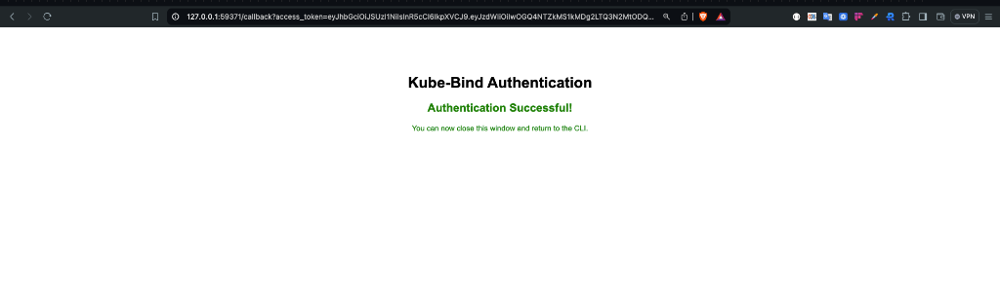

```text
Connecting to kube-bind server http://kube-bind.local:8080...
Started local callback server at http://127.0.0.1:59371/callback
Opening browser for authentication...
🔑 Successfully authenticated to kube-bind.local:8080
Configuration saved to: /Users/olalekanodukoya/.kube-bind/config
```

Now bind the API:

```bash
kubectl bind http://kube-bind.local:8080
```

The CLI will once again open your browser to confirm the binding. Since you just logged in, Keycloak's SSO will likely skip the username/password prompt and take you straight to the resource selection screen.

Select **Cowboys** in the browser UI and click **Bind for CLI**.

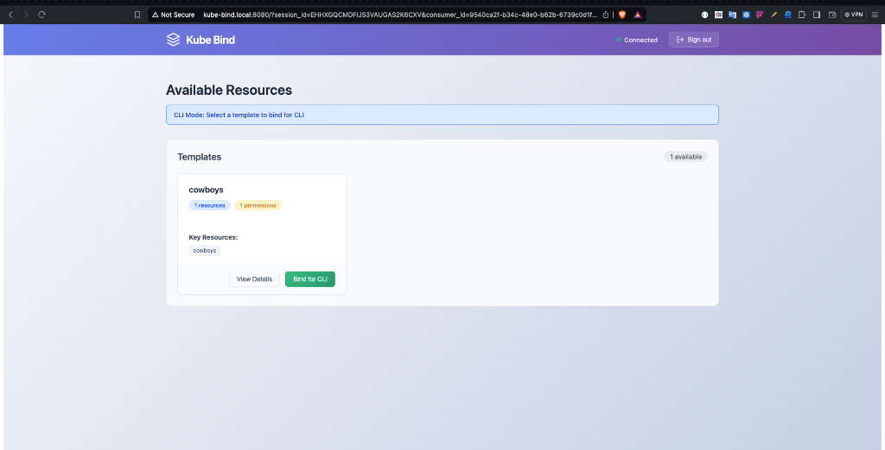

```text
🌐 Opening kube-bind UI in your browser...
    http://kube-bind.local:8080?consumer_id=ef0dc4ce-c867-48eb-ba6d-94178eefeca5&redirect_url=http%3A%2F%2F127.0.0.1%3A53613%2Fcallback&session_id=OV4RLFOX2V7HXSTY5FFJFGF4BX

Browser opened successfully
Waiting for binding completion from UI...
   (Press Ctrl+C to cancel)

Binding completed successfully!
Created kube-bind namespace.
🔒 Created secret kube-bind/kubeconfig-2gf2s for host https://provider-control-plane:6443, namespace kube-bind-4fx0okhmvche
🚀 Deploying konnector v0.7.1 to namespace kube-bind.
   Waiting for the konnector to be ready.............
✅ Created APIServiceBinding cowboys for 1 resources
Created 1 APIServiceBinding(s):
  - cowboys
Resources bound successfully!

```

---

## Step 7: Verify It Works

Check that the CRD is now available in the consumer:

```bash
kubectl get crd cowboys.wildwest.dev
```

Create a resource:

```bash
kubectl apply -f - <<EOF
apiVersion: wildwest.dev/v1alpha1
kind: Cowboy
metadata:
  name: wyatt-earp
  namespace: default
spec:
  intent: "Keep the peace"
EOF

kubectl get cowboys
```

```text
NAME         AGE
wyatt-earp   4s
```

The resource is created in the consumer cluster and synced to the provider — all authenticated through Keycloak.

---

## Conclusion

In this (relatively short 😄) tutorial, we've seen how straightforward it is to swap out `kube-bind`'s embedded OIDC provider for Keycloak. With a real identity provider in place, you get proper user management, group-based access control, and token lifecycle management out of the box.

In a regular production setup, ensure you're using HTTPS everywhere and storing your Keycloak client secret in a proper secrets manager. The [Installation with Helm](../../setup/helm.md) guide covers the full production setup.

Check out the integration guides to see what you can actually bind once this is all set up:

- [**Crossplane**](../../usage/integrations/crossplane.md): Cloud resources as a service
- [**CloudNativePG**](../../usage/integrations/cloudnativepg.md): Database-as-a-Service
- [**cert-manager**](../../usage/integrations/cert-manager.md): Certificate management as a service

Thank you!
