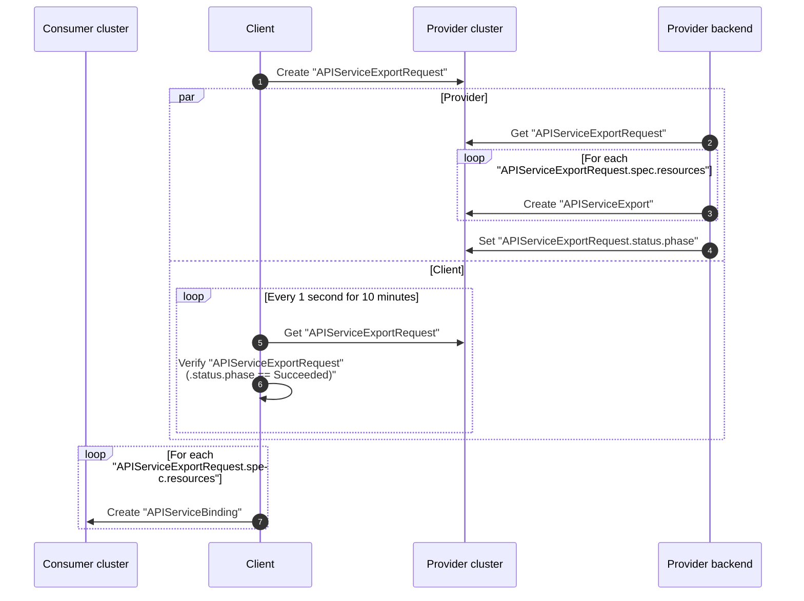

# API Binding

## Overview

## Contracts

**APIServiceExportRequest**

In case the _APIServiceExportRequest_ is accepted, the provider backend **must** ensure that

* for each `APIServiceExportRequest.spec.resources` an `APIServiceExport` is created
* each `APIServiceExport` is created in the namespace of the `APIServiceExportRequest`
* each `APIServiceExport` is created with a name following the pattern `resource.resource + "." + resource.group`
* the `APIServiceExportRequest.status.phase` is set to `Succeeded`

In case the _APIServiceExportRequest_ is declined, the provider backend **must** ensure that

* the `APIServiceExportRequest.status.terminalMessage` is set to a human readable message describing the reason
* the `APIServiceExportRequest.status.phase` is set to `Failed`
