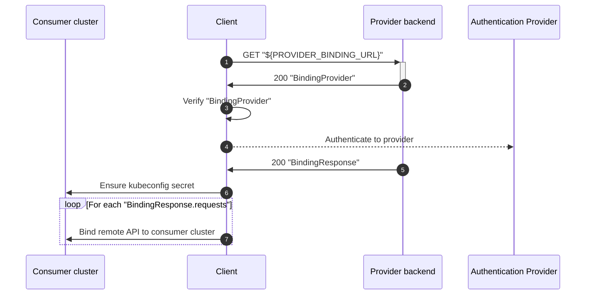

# Cluster Binding

## Overview



## Contracts

**BindingResponse**

In case the cluster binding request is accepted, the provider backend **must** ensure that

* the kubeconfig returned in the `BindingResponse` contains a current context
* the configured current context points to the "cluster namespace"
* the `ClusterBinding` object named "cluster" exists in the "cluster namespace"
* the secret referenced by `ClusterBinding.spec.kubeconfigSecretRef.name` exists
* the key of the secret referenced by `ClusterBinding.spec.kubeconfigSecretRef.key` contains a valid kubeconfig
* the configured current context points to a user with at least the following permissions in the "cluster namespace" (here expressed as RBAC rules)
  ```yaml
  - apiGroups: ["kube-bind.io"]
    resources: ["apiserviceexportrequests"]
    verbs: ["create", "delete", "patch", "update", "get", "list", "watch"]

  - apiGroups: ["kube-bind.io"]
    resources: ["apiserviceexports"]
    verbs: ["get", "watch", "list"]
  - apiGroups: ["kube-bind.io"]
    resources: ["apiserviceexports/status"]
    verbs: ["get", "patch", "update"]

  - apiGroups: ["kube-bind.io"]
    resources: ["apiservicenamespaces"]
    verbs: ["create", "delete", "patch", "update", "get", "list", "watch"]

  - apiGroups: ["kube-bind.io"]
    resources: ["clusterbindings"]
    verbs: ["get", "watch", "list"]
  - apiGroups: ["kube-bind.io"]
    resources: ["clusterbindings/status"]
    verbs: ["get", "patch", "update"]

  - apiGroups: [""]
    resources: ["secrets"]
    verbs: ["get", "watch", "list"]
  ```
