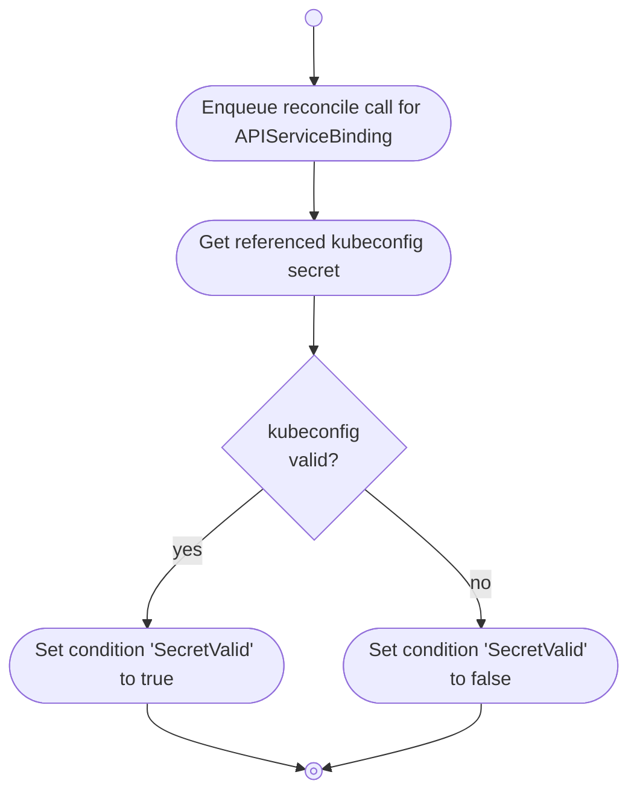

# APIServiceBindings

The APIServiceBinding controller watches `APIServiceBindings` and the referenced `Secrets` in the **consumer
cluster**.

It is responsible for:

* validating the kubeconfig stored in the secrets referenced by `APIServiceBindings`

## Overview

