# APIServiceBindings

The APIServiceBinding controller watches `APIServiceBindings`, and `CRDs` in the **consumer cluster** and `APIServiceExports` in the **provider cluster**.

It is responsible for:

* synchronizing `APIServiceExports` in the **provider cluster** to `CRDs` in the **consumer cluster**

## Overview

```mermaid
flowchart TD
    %% Nodes
    start@{ shape: start }
    stop@{ shape: stop }

    enqueue_reconcile(["Enqueue reconcile call for APIServiceBinding"])

    is_apiservicebinding_owned{"binding<br>owned?"}
    set_apiservicebinding_condition_connected_to_true(["Set condition 'Connected' to true"])
    set_apiservicebinding_condition_connected_to_false(["Set condition 'Connected' to false"])
    set_apiservicebinding_condition_schemainsync_to_true(["Set condition 'SchemaInSync' to true"])

    get_apiserviceexport(["Get APIServiceExport"])
    is_apiserviceexport_present{"export<br>exists?"}

    get_bound_schemas(["Get all referenced
    BoundSchemas from
    APIServiceExport"])
    bound_schema_fetch_successful(["Fetching BoundSchemas
    succeed?"])
    reference_bound_schema(["Reference BoundSchema
    in APIServiceBinding
    status"])
    convert_boundschema_to_crd(["Convert BoundSchema
    to CRD"])


    get_crd(["Get CRD"])
    create_crd(["Create CRD"])
    update_crd(["Update CRD"])
    is_crd_present{"CRD<br>exists?"}
    is_crd_owned{"CRD<br>owned?"}

    get_clusterbinding(["Get ClusterBinding"])
    set_apiservicebinding_provider_name(["Set provider name"])

    %% Transitions
    start --> enqueue_reconcile
    enqueue_reconcile --> is_apiservicebinding_owned

    is_apiservicebinding_owned --> |yes| get_apiserviceexport
    get_apiserviceexport --> is_apiserviceexport_present
    is_apiserviceexport_present --> |yes| get_bound_schemas
    is_apiserviceexport_present --> |no| set_apiservicebinding_condition_connected_to_false
    get_bound_schemas --> bound_schema_fetch_successful
    bound_schema_fetch_successful --> |yes| reference_bound_schema
    bound_schema_fetch_successful --> |no| set_apiservicebinding_condition_connected_to_false
    reference_bound_schema --> convert_boundschema_to_crd
    set_apiservicebinding_condition_connected_to_false --> stop

    convert_boundschema_to_crd -->  get_crd

    get_crd --> is_crd_present
    is_crd_present --> |no| create_crd
    is_crd_present --> |yes| is_crd_owned
    create_crd --> update_crd

    update_crd --> set_apiservicebinding_condition_connected_to_true
    set_apiservicebinding_condition_connected_to_true --> set_apiservicebinding_condition_schemainsync_to_true

    is_crd_owned --> |yes| update_crd
    is_crd_owned --> |no| set_apiservicebinding_condition_connected_to_false

    set_apiservicebinding_condition_schemainsync_to_true --> get_clusterbinding
    get_clusterbinding --> set_apiservicebinding_provider_name
    is_apiservicebinding_owned --> |no| stop
    set_apiservicebinding_provider_name --> stop
```

