# APIServiceExports

The APIServiceExport controller watches `APIServiceExports` and the referenced resources in the **provider cluster**.

Starting with v1alpha2, the APIServiceExport has been refactored to use a resource-based model instead of embedded CRD specifications.

## Key Changes in v1alpha2

- **Resource-Based Model**: `APIServiceExportSpec` now uses `Resources []APIServiceExportResource` instead of embedded CRD specs
- **Multi-Resource Support**: One APIServiceExport can reference multiple CRDs more efficiently
- **BoundSchema Integration**: Works with the new `BoundSchema` resource type for tracking bound schemas in consumer clusters

## Controller Responsibilities

* Ensuring the existence and validity of `APIServiceExports`.
* Managing the lifecycle of `APIServiceExports` by starting and stopping spec and status syncers and controllers.
* Checking `APIServiceBinding` condition and setting `ConsumerInSync` condition in `APIServiceExport`
* Managing resource references and their associated schemas.

## Overview

```mermaid
flowchart TD
    %% Nodes
    start@{ shape: start }
    stop@{ shape: stop }

    enqueue_reconcile(["Enqueue reconcile call
    for APIServiceExport"])
    is_apiserviceexport_present{"APIServiceExport<br>exists?"}

    get_bound_schemas(["Get referenced
    BoundSchemas"])
    get_bound_schemas2(["Get referenced
    BoundSchemas"])
    is_bound_schema_present{"BoundSchema<br>exists?"}
    update_bound_schema(["Update BoundSchema
    status"])

    stop_apiserviceexport_sync(["Stop APIServiceExport sync"])

    get_binding(["Get referenced
    APIServiceBinding"])
    get_binding2(["Get referenced
    APIServiceBinding"])

    is_binding_present{"APIServiceBinding<br>exists?"}
    is_binding_present2{"APIServiceBinding<br>exists?"}

    is_binding_schemainsync{"APIServiceBinding<br>has SchemaInSync?"}
    start_new_syncer(["Start new syncer"])

    set_apiserviceexport_condition_connected_to_true(["Set condition
    'Connected' to true"])
    set_apiserviceexport_condition_connected_to_false(["Set
    condition 'Connected'
to false"])
    set_apiserviceexport_condition_consumerinsync_to_true(["Set condition
    'ConsumerInSync' to true"])
    set_apiserviceexport_condition_consumerinsync_to_false(["Set condition
    'ConsumerInSync' to false"])

    get_crd(["Get referenced
    CustomResourceDefinition"])
    copy_crd_conditions(["Copy CRD conditions
    to APIServiceExport
    conditions"])
    set_summary_condition(["Set summary
    of all conditions
    on APIServiceExport"])


    %% Transitions
    start --> enqueue_reconcile
    enqueue_reconcile --> is_apiserviceexport_present
    is_apiserviceexport_present --> |no| stop
    is_apiserviceexport_present --> |yes| get_binding

    get_binding --> is_binding_present
    is_binding_present --> |yes| get_bound_schemas
    is_binding_present --> |no| stop_apiserviceexport_sync
    stop_apiserviceexport_sync --> stop

    get_bound_schemas --> is_bound_schema_present
    is_bound_schema_present --> |yes| start_new_syncer
    is_bound_schema_present --> |no| stop_apiserviceexport_sync
    stop_apiserviceexport_sync --> stop

    start_new_syncer --> get_binding2
    get_binding2 --> is_binding_present2
    is_binding_present2 --> |yes| set_apiserviceexport_condition_connected_to_true
    is_binding_present2 --> |no| set_apiserviceexport_condition_connected_to_false
    set_apiserviceexport_condition_connected_to_false --> set_apiserviceexport_condition_consumerinsync_to_false
    set_apiserviceexport_condition_connected_to_true --> is_binding_schemainsync
    is_binding_schemainsync --> |yes| set_apiserviceexport_condition_consumerinsync_to_true
    set_apiserviceexport_condition_consumerinsync_to_true --> get_bound_schemas2
    is_binding_schemainsync --> |no| set_apiserviceexport_condition_consumerinsync_to_false
    set_apiserviceexport_condition_consumerinsync_to_false --> get_bound_schemas2

    get_bound_schemas2 --> get_crd
    get_crd --> copy_crd_conditions
    copy_crd_conditions --> set_summary_condition
    set_summary_condition --> update_bound_schema
    update_bound_schema --> stop
```

