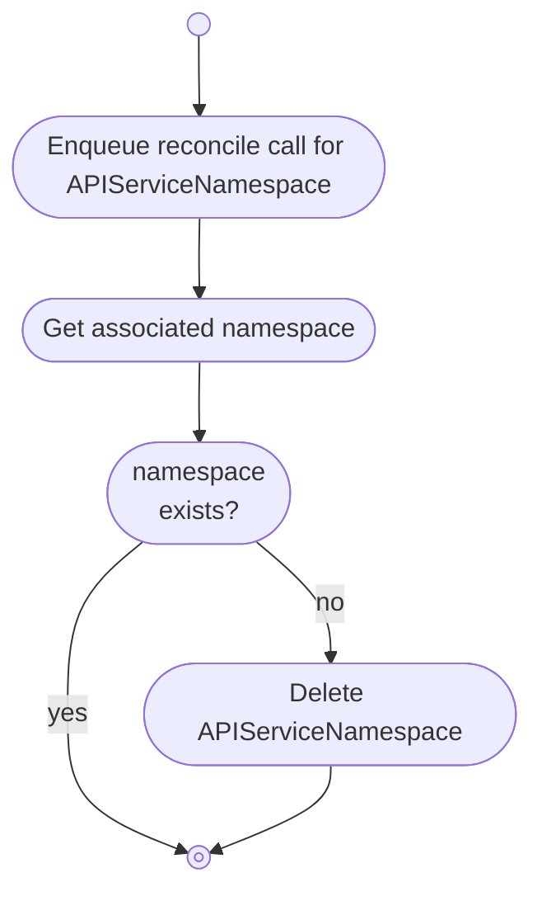

# APIServiceNamespaces

The APIServiceNamespace controller watches `Namespaces` in the **consumer cluster** and `APIServiceNamespaces` in the **provider cluster**.

It is responsible for:

* synchronizing `Namespaces` in the **consumer cluster** with `APIServiceNamespaces` in the **provider cluster**

## Overview

