# ClusterBindings

The ClusterBinding controller watches `Secrets` (referenced by `APIServiceBindings`) in the **consumer
cluster** and `ClusterBindings`, the referenced `Secrets`, and `APIServiceExport` in the **provider
cluster**.

It is responsible for:

* synchronizing the secret referenced by the `ClusterBinding` in the **provider cluster** to the secret referenced by the `APIServiceBindings` in the **consumer cluster**
* reporting heartbeat to `ClusterBinding` in the **provider cluster**
* reporting konnector version `ClusterBinding` in the **provider cluster**
* reporting heartbeat to all `APIServiceBindings` managed by `ClusterBinding` in the **consumer cluster**

## Overview

```mermaid
flowchart TD
    %% Nodes
    start@{ shape: start }
    stop@{ shape: stop }

    enqueue_reconcile(["Enqueue reconcile call for ClusterBinding"])

    update_cluster_binding(["Update ClusterBinding"])
    is_cluster_binding_update_successful{"update<br>successful?"}

    get_cluster_binding_kubeconfig_secret(["Get referenced provider kubeconfig secret"])
    is_cluster_binding_kubeconfig_secret_valid{"secret<br>valid?"}

    set_cluster_binding_condition_secret_valid_to_true(["Set condition 'SecretValid' to true"])
    set_cluster_binding_condition_secret_valid_to_false(["Set condition 'SecretValid' to false"])
    set_cluster_binding_condition_valid_version_to_true(["Set condition 'ValidVersion' to true"])
    set_cluster_binding_condition_valid_version_to_false(["Set condition 'ValidVersion' to false"])
    set_cluster_binding_condition_ready(["Set condition 'Ready' to summary"])

    set_cluster_binding_status_last_heartbeat(["Set status 'LastHeartbeatTime' to now"])
    set_cluster_binding_status_konnector_version(["Set status 'KonnectorVersion'"])

    get_api_binding_kubeconfig_secret(["Get consumer kubeconfig secret"])
    create_api_binding_kubeconfig_secret(["Create consumer kubeconfig secret"])
    update_api_binding_kubeconfig_secret(["Update consumer kubeconfig secret"])
    is_api_binding_kubeconfig_secret_present{"secret<br>exists?"}

    set_api_binding_status_heartbeating_to_true(["Set APIServiceBinding conditions 'Heartbeating' to true"])
    set_api_binding_status_heartbeating_to_false(["Set APIServiceBinding conditions 'Heartbeating' to false"])

    get_konnector_version(["Get konnector version"])
    is_konnector_version_valid{"version<br>valid?"}

    %% Transitions
    start --> enqueue_reconcile
    enqueue_reconcile --> get_cluster_binding_kubeconfig_secret
    get_cluster_binding_kubeconfig_secret --> is_cluster_binding_kubeconfig_secret_valid

    is_cluster_binding_kubeconfig_secret_valid --> |yes| get_api_binding_kubeconfig_secret
        get_api_binding_kubeconfig_secret --> is_api_binding_kubeconfig_secret_present
        is_api_binding_kubeconfig_secret_present --> |yes| update_api_binding_kubeconfig_secret
        is_api_binding_kubeconfig_secret_present --> |no| create_api_binding_kubeconfig_secret
        update_api_binding_kubeconfig_secret --> set_cluster_binding_condition_secret_valid_to_true
        create_api_binding_kubeconfig_secret --> set_cluster_binding_condition_secret_valid_to_true

    is_cluster_binding_kubeconfig_secret_valid --> |no| set_cluster_binding_condition_secret_valid_to_false

    set_cluster_binding_condition_secret_valid_to_true --> set_cluster_binding_status_last_heartbeat
    set_cluster_binding_condition_secret_valid_to_false --> set_cluster_binding_status_last_heartbeat

    set_cluster_binding_status_last_heartbeat --> get_konnector_version
    get_konnector_version --> is_konnector_version_valid

    is_konnector_version_valid --> |yes| set_cluster_binding_status_konnector_version
        set_cluster_binding_status_konnector_version --> set_cluster_binding_condition_valid_version_to_true

    is_konnector_version_valid --> |no| set_cluster_binding_condition_valid_version_to_false

    set_cluster_binding_condition_valid_version_to_true --> set_cluster_binding_condition_ready
    set_cluster_binding_condition_valid_version_to_false --> set_cluster_binding_condition_ready

    set_cluster_binding_condition_ready --> update_cluster_binding
    update_cluster_binding --> is_cluster_binding_update_successful

    is_cluster_binding_update_successful --> |yes| set_api_binding_status_heartbeating_to_true
    is_cluster_binding_update_successful --> |no| set_api_binding_status_heartbeating_to_false

    set_api_binding_status_heartbeating_to_true --> stop
    set_api_binding_status_heartbeating_to_false --> stop
```

