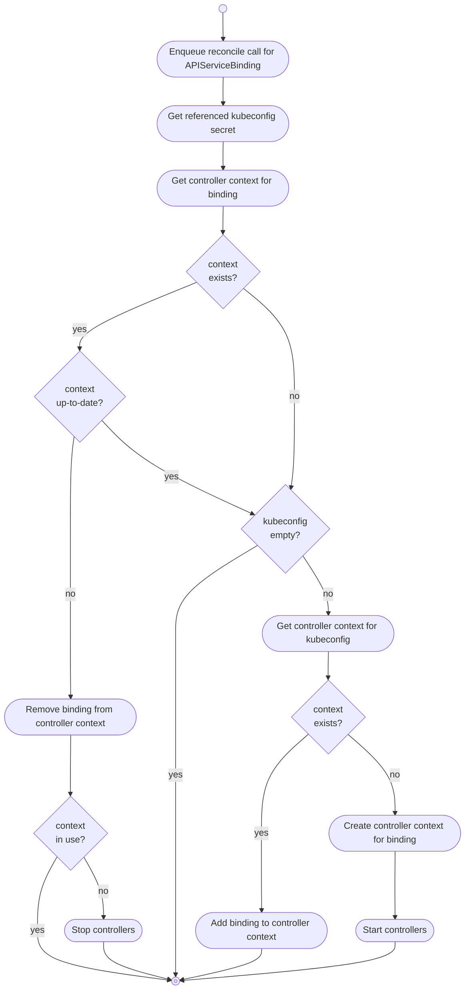

# konnector

The konnector implements the main reconciliation loop and watches `APIServiceBindings` and the referenced `Secrets` in the **consumer cluster**.

It is responsible for:

* starting / stopping a set of controllers per service provider

## Overview

