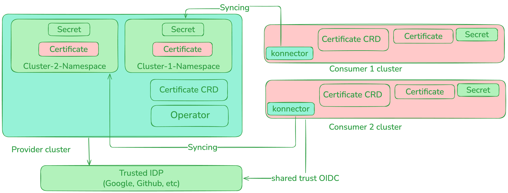

# kube-bind Documentation

## Overview 

kube-bind is a project that aims to provide better support for service providers and consumers that reside in distinct Kubernetes clusters.
We are actively working towards a stable release, and welcome feedback from the community.

- A service provider defines its API contract in terms of CRDs and associated permission claims/limitations, and exports it for use from other clusters.
- Service consumers identify the services they want to consume using CLI or Web UI.
- The service CRDs get installed in the service consumer clusters, with objects of the defined kinds written and read by the service consumers.
- The service provider indirectly reads and writes those objects as the interface to the service that it provides.
- The service provider does not inject controllers/operators into the service consumer's cluster.
- A single vendor-neutral, OpenSource agent - `konnector` per consumer cluster connects it with the requested services.

## Quickstart

To get started with trying out kube-bind on your local system, check out our [Quickstart](./setup/quickstart.md) instructions.

## Contributing

We ❤️ our contributors! If you're interested in helping us out, please head over to our [Contributing](./contributing/index.md)
guide.

## Getting in touch

There are several ways to communicate with us:

- The [`#kube-bind` channel](https://kubernetes.slack.com/archives/C046PRXNJ4W) in the [Kubernetes Slack workspace](https://slack.k8s.io).
- Our mailing lists:
    - [kube-bind-dev](https://groups.google.com/g/kube-bind-dev) for development discussions.
- By joining the kube-bind-dev mailing list, you should receive an invite to our bi-weekly community meetings.