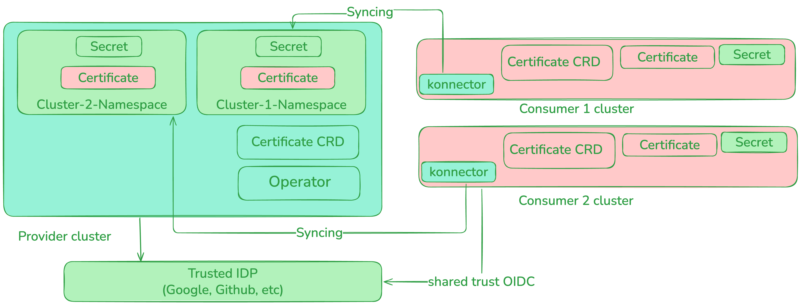

# kube-bind Documentation

## Overview 

kube-bind is a project that aims to provide better support for service providers and consumers that reside in distinct Kubernetes clusters.
We are actively working towards a stable release, and welcome feedback from the community.

- A service provider defines its API contract in terms of CRDs and associated permission claims/limitations, and exports it for use from other clusters.
- Service consumers identify the services they want to consume using CLI or Web UI.
- The service CRDs get installed in the service consumer clusters, with objects of the defined kinds written and read by the service consumers.
- The service provider indirectly reads and writes those objects as the interface to the service that it provides.
- The service provider does not inject controllers/operators into the service consumer's cluster.
- A single vendor-neutral, OpenSource agent - `konnector` per consumer cluster connects it with the requested services.

## Getting Started

- **[Quickstart](./setup/quickstart.md)** - Get up and running with kube-bind quickly
- **[Setup Guide](./setup/index.md)** - Complete installation and deployment options
- **[Usage Guide](./usage/index.md)** - Learn the core concepts and APIs

## Contributing

We ❤️ our contributors! If you're interested in helping us out, please head over to our [Contributing](./contributing/index.md)
guide.

## Getting in touch

There are several ways to communicate with us:

- The [`#kube-bind` channel](https://kubernetes.slack.com/archives/C046PRXNJ4W) in the [Kubernetes Slack workspace](https://slack.k8s.io).
- Our mailing lists:
    - [kube-bind-dev](https://groups.google.com/g/kube-bind-dev) for development discussions.
- Our bi-weekly community meetings — every second Thursday at 11am EST (5pm CET).
    - By joining the [kube-bind-dev mailing list](https://groups.google.com/g/kube-bind-dev), you should receive an invite.
    - See our [community meeting notes document](https://docs.google.com/document/d/1qztpKOmdZu5iWq_4N9n3AZpcAPuPhBiGNbje5GPg0iM) for upcoming and past agendas.
    <!-- TODO(community-call-advertise): once the CNCF community page is registered, add a sub-bullet linking to https://community.cncf.io/kube-bind/ -->
    <!-- TODO(community-call-advertise): once a YouTube channel is set up, add a sub-bullet linking to recordings. -->

See the [community page](./community/index.md) for more details.