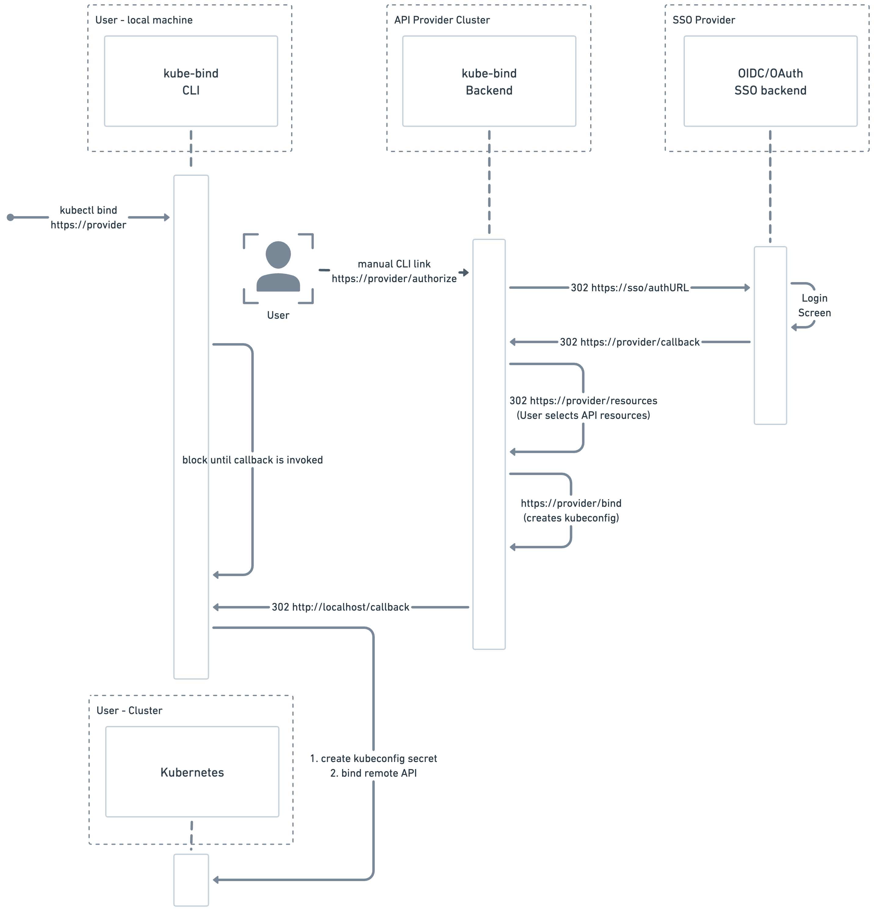
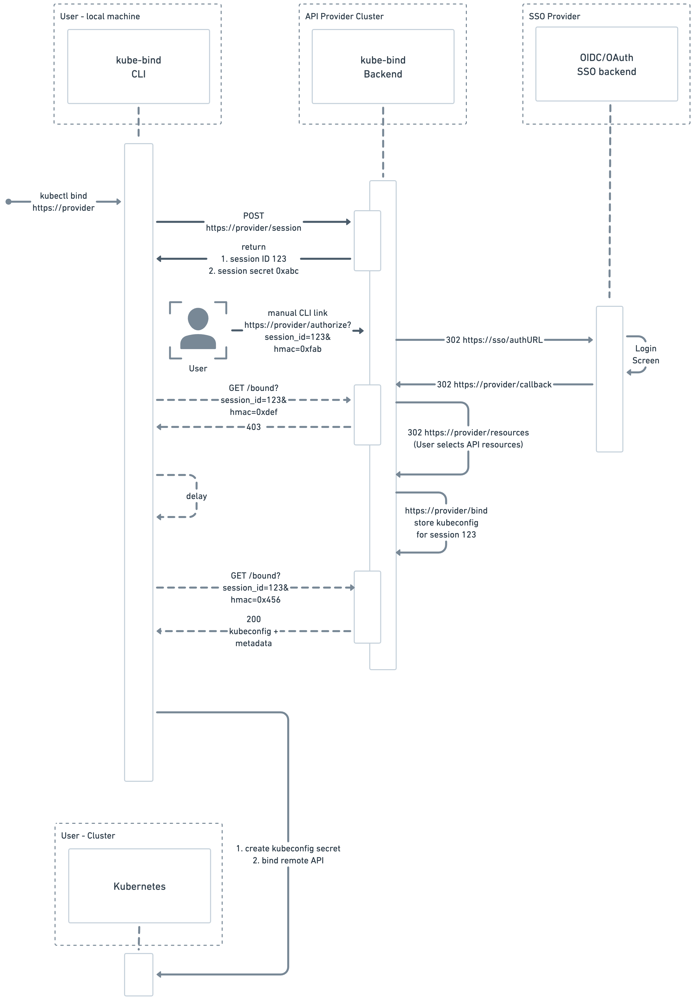

* **Owners:**
    * @s-urbaniak

* **Related Tickets:**
    * N/A

## Summary

kube-bind offers a user-friendly approach of being able to bind API resources provided by an external party using a simple URL. This URL can be invoked directly via the terminal and the rest of the binding process is finalized in a user web browser session.

At the end a local callback ensures that the necessary metadata of the binding process is passed back to the kubectl `bind` process.

While being user-friendly the current approach has a couple of drawbacks. An alternative method is described which adds a new "polling" based approach vs. the current "callback" based approach.

## Why

kube-bind allows to bind APIs offered by providers using a URL passed to the `bind` subcommand.
As part of the binding process the following steps are executed:

1. The kubectl `bind` plugin retrieves provider metadata
which includes information about supported authentication methods at the provider.
Currently, OAuth 2 code grant flow is supported.
2. The kubectl `bind` renders an authentication URL on the terminal,
augmented with additional session data.
3. The user executes the rendered URL link
and finalizes authentication and API selection in his local browser.

kubectl `bind` plugin blocks until authentication and API selection is finalized.
Currently, this is accomplished using a localhost web server listening on an ephemeral local port on the user machine.

After the end of the above process the kube-bind backend invokes an HTTP 302 localhost redirect in the user browser session. The callback URL includes a serialized `kubebindv1alpha1.BindingResponse` JSON object. This object is passed as a base64 encoded `response` parameter which is added to the callback localhost URL as a query parameter.

The following figure illustrates the current process:


Link: https://whimsical.com/kube-bind-auth-flow-FYCNPvj5m27pKUDVYxVRGy

The current solution has a couple of drawbacks:

1. The kubectl `bind` plugin starts localhost a web server running on the user machine. This makes it currently impossible to use kubectl `bind` on a remote machine i.e. via an SSH session.

2. The serialized encoded length of the `kubebindv1alpha1.BindingResponse` is currently passed as a URL parameter which should not exceed ~2000 characters in most web browser implementations. Worse, this upper bound is not standardized. Finally, passing large URL parameters is not recommended. 

The current method will be called as "callback based" approach in the remainder of this proposal.

## Goals

1. **MUST** enable the possibility to use kubectl `bind` on a remote machine i.e. via an SSH session.
2. **MUST** remove the necessity to start a localhost web server on the user machine.
3. **MUST** remove the limitation of encoding the binding response object via a URL query parameter.
4. **MUST** retain user-friendliness of invoking a single URL to bind external APIs.

## How

### kubectl `bind`

Next to the above describe "callback based" approach kubectl `bind` additionally supports a "polling" based approach.

Instead of having a localhost web server blocking until a callback http request is executed by the user web browser session, the kubectl `bind` process regularly polls the kube-bind backend whether the authentication and API resource selection process is finalized.

As a result, the kubectl `bind` process downloads the `kubebindv1alpha1.BindingResponse` JSON object directly from the polled URL.

Here, the following steps are executed:

1. The kubectl `bind` plugin retrieves provider metadata
which includes information about supported authentication methods at the provider.

Here, a new authentication polling based variant of the OAuth2 code grant called `OAuth2CodeGrantPoll` is introduced:

```go
type BindingProvider struct {
  metav1.TypeMeta `json:",inline"`

  AuthenticationMethods []AuthenticationMethod `json:"authenticationMethods,omitempty"`
}

  type AuthenticationMethod struct {
  // method is the name of the authentication method. The follow methods are supported:
  //
  // - "OAuth2CodeGrant"
  // - "OAuth2CodeGrantPoll"
  //
  Method string `json:"method,omitempty"`

  // OAuth2CodeGrant is the configuration for the OAuth2 code grant flow.
  OAuth2CodeGrant *OAuth2CodeGrant `json:"oauth2CodeGrant,omitempty"`

  // OAuth2CodeGrant is the configuration for the OAuth2 code grant flow
  // using a poll based approach.
  OAuth2CodeGrantPoll *OAuth2CodeGrantPoll `json:"oauth2CodeGrantPoll,omitempty"`
}

type OAuth2CodeGrantPoll struct {
  // sessionURL is the service provider url that the service consumer will use to create a new session.
  // The session is valid during the authentication and resource selection process.
  // Once resource selection and binding is finalized, the session is invalidated.
  //
  // +required
  // +kubebuilder:validation:Required
  // +kubebuilder:validation:MinLength=1
  SessionURL string `json:"sessionURL"`

  // authenticatedURL is the service provider url that the service consumer will use to authenticate against
  // the service provider in case of using OIDC mode made, e.g: www.mangodb.com/kubernetes/authorize.
  //
  // +required
  // +kubebuilder:validation:Required
  // +kubebuilder:validation:MinLength=1
  AuthenticatedURL string `json:"authenticatedURL"`

  // pollURL is the service provider url that is used to be poll regularly, i.e. "www.mangodb.com/bound".
  // The backend returns a HTTP 403 while the process is ongoing
  // and a HTTP 200 status code once the authentication and API resource selection is finalized.
  // The http response body includes the `kubebindv1alpha1.BindingResponse` object.
  //
  // +required
  // +kubebuilder:validation:Required
  // +kubebuilder:validation:MinLength=1
  PollURL string `json:"pollURL"`

  // pollInterval is the expected polling interval in Go's `time.Duration` format.
  // If exceeded, the kube-bind backend may return a 429 Too Many Requests http status code.
  //
  // +required
  // +kubebuilder:validation:Required
  // +kubebuilder:validation:MinLength=1
  PollInterval string `json:"pollInterval"`
}
```

2. The kubectl `bind` renders an authentication URL on the terminal.

3. The user executes the rendered URL link
and finalizes authentication and API selection in his local browser.

4. kubectl `bind` regularly polls at every `pollInterval`.
While the user process is ongoing in the user browser session
the kube-bind backend returns an HTTP 403 status code.
Once the user process is finalized the kube-bind backend returns an HTTP 200 status code.
The response body includes the `kubebindv1alpha1.BindingResponse` object.

kubectl `bind` plugin blocks until authentication and API selection is finalized.

The following figure illustrates the poll based approach:


Link: https://whimsical.com/kube-bind-auth-flow-FYCNPvj5m27pKUDVYxVRGy

### Backend conventions

#### Existing `oauth2CodeGrant` protocol

The existing `oauth2CodeGrant` authentication method implies the following protocol conventions:

- **MUST** client invokes an authentication URL given by the `authenticatedURL`
- **MUST** The authentication URL includes mutually exclusively either 1. a localhost callback port parameter `p`
or 2. an explicit callback URL parameter `u`.
In the case of a given localhost port parameter former case a `http://localhost:<p>/callback` callback URL is assumed.
- **MUST** The authentication URL includes a session ID `s` that is generated on client side.
- **MUST** The authentication URL includes a cluster ID `c` that is generated on client side.

#### Proposed `oauth2CodeGrantPoll` protocol

The proposed `oauth2CodeGrantPoll` introduces the following changes:

1. The callback URL is removed, it is unneeded.
2. Both, the session ID and cluster ID generation are now in the responsibility of the backend, not the client.
3. An additional ephemeral session secret is generated on the backend side.

- **MUST** client invokes a HTTP POST request against the `sessionURL`.
The backend returns a `kubebindv1alpha1.Oauth2CodeGrantPollSession` response with the following attributes:
```go
// Oauth2CodeGrantPollSession is a non-CRUD resource that is returned by the server before
// authentication.
// It specifies the necessary session attributes and secrets
// for a polling based OAuth2 Code Grant backed binding process.
type Oauth2CodeGrantPollSession struct {
  metav1.TypeMeta `json:",inline"`

  // sessionID is a unique identifier for this binding session. It is valid until authentication,
  // resource selection, and binding is finalized.
  //
  // +required
  // +kubebuilder:validation:Required
  // +kubebuilder:validation:MinLength=1
  SessionID string `json:"sessionID"`

  // clusterID is a unique identifier for the cluster where resources are bound to.
  // The cluster ID is valid beyond the authentication, resource selection, and binding process.
  //
  // +required
  // +kubebuilder:validation:Required
  // +kubebuilder:validation:MinLength=1
  ClusterID string `json:"clusterID"`

  // sessionSecret is an ephemeral secret that is valid for this session only.
  // It is used to sign all subsequent requests during the authentication, resource selection, and binding process.
  //
  // +required
  // +kubebuilder:validation:Required
  // +kubebuilder:validation:MinLength=1
  SessionSecret string `json:"sessionSecret"`
}
```
- **MUST** The authentication URL includes a session ID query parameter `s` that was returned from the backend.
- **MUST** The authentication URL includes a base64 encoded SHA256 HMAC signature query parameter `h` that is generated on client side.
The signature signs a payload consisting of all request parameters, the host, scheme, and request body.
- **MUST** The authentication URL includes a random nonce `n` that is generated on client side.

The described scheme is heavily inspired by the concept of a credentialed client as part of OAuth 2.1 [1].
Using this scheme every client has credentials (the ephemeral session secret provided by the backend)
but its identity is not established by the backend.

[1] https://datatracker.ietf.org/doc/html/draft-ietf-oauth-v2-1-00#section-2.1

### Reference implementation

The existing reference implementation needs to be extended to be able to handle the above described polling based approach.
Most notably the existing implementation needs to maintain session state.
To accomplish this, the reference implementation will include a hashring based cache which stores the necessary session data.
For simplicity this proposal suggests to use groupcache [2] which has support for consistent hashing.
It lacks native support for TTL but this can be achieved using application logic.

[2] https://github.com/golang/groupcache

# Alternatives
